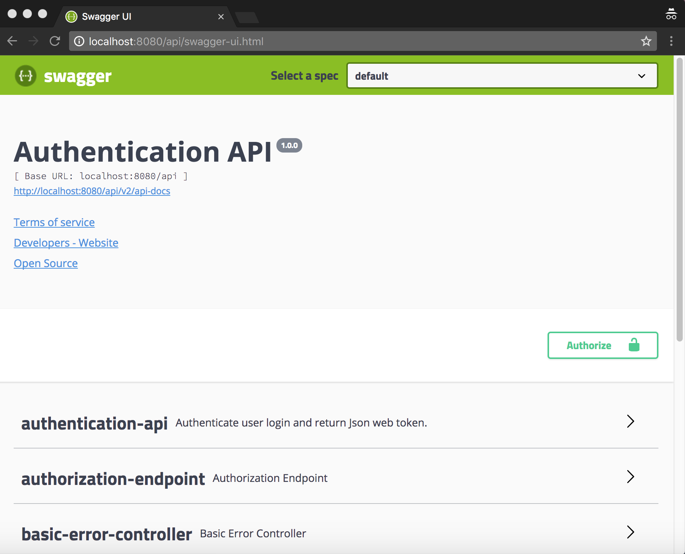
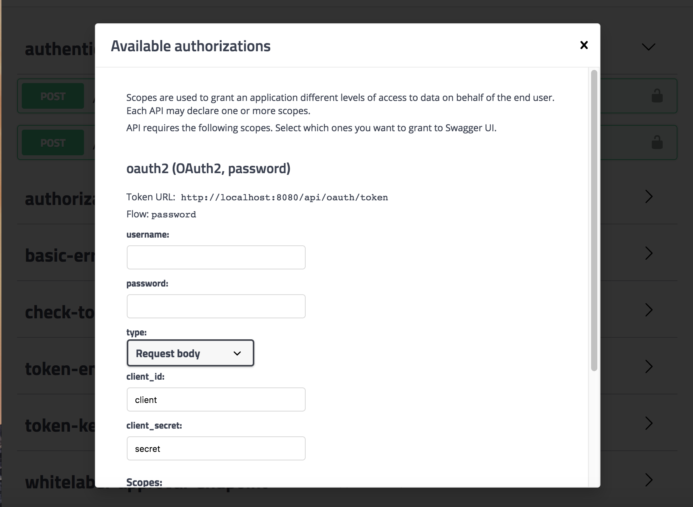
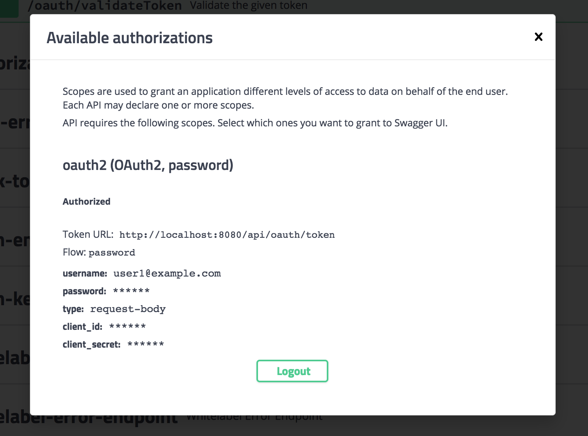
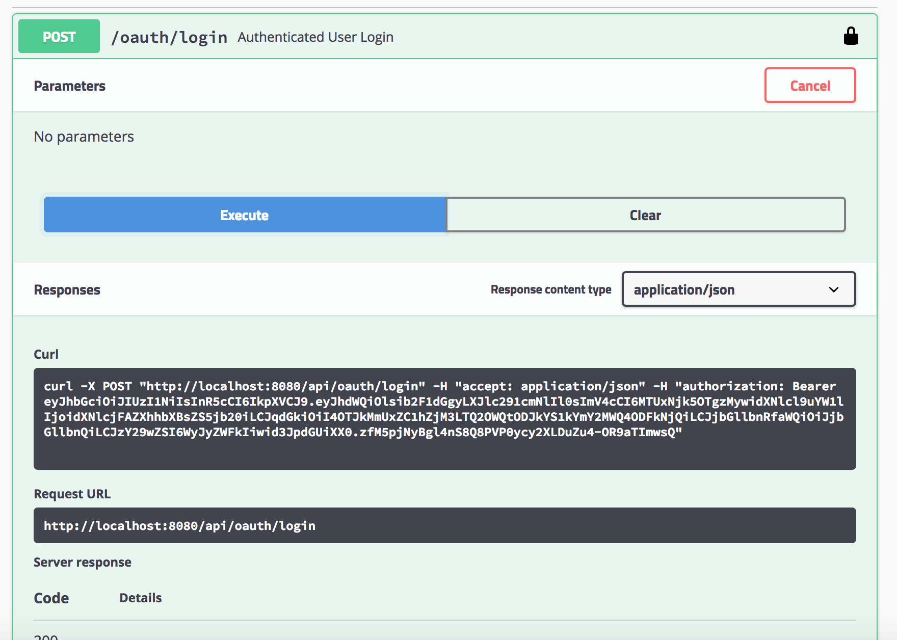

* [Spring Boot + OAuth 2.0 + JWT + Swagger-UI 2](https://github.com/rrohitramsen/spring-boot-oauth2-jwt-swagger-ui)


## How to start ?

```
$ mvn spring-boot:run
```

## Swagger-UI
* After starting the application Click on [Swagger-home](http://localhost:8092/api/swagger-ui.html)




## User Data

```
   user-name         | password
   user1@example.com | password
   user2@example.com | password
   user3@example.com | password
```


## Authorize
* Use above given user details to login and generate the authorization token.




* Login using the generated token



## Change OAuth configuration
* Edit the configuration in the file [application.properties](src/main/resources/application.properties)

```
server.port=8092
server.contextPath=/api

logging.level.com.alfred=DEBUG

# Data source properties
spring.jpa.hibernate.ddl-auto=validate
spring.jpa.show-sql=true

# openssl genrsa -out jwt.pem 2048
# openssl rsa -in jwt.pem
config.oauth2.privateKey=MIICXQIBAAKBgQDNQZKqTlO/+2b4ZdhqGJzGBDltb5PZmBz1ALN2YLvt341pH6i5mO1V9cX5Ty1LM70fKfnIoYUP4KCE33dPnC7LkUwE/myh1zM6m8cbL5cYFPyP099thbVxzJkjHWqywvQih/qOOjliomKbM9pxG8Z1dB26hL9dSAZuA8xExjlPmQIDAQABAoGAImnYGU3ApPOVtBf/TOqLfne+2SZX96eVU06myDY3zA4rO3DfbR7CzCLE6qPnyDAIiW0UQBs0oBDdWOnOqz5YaePZu/yrLyj6KM6Q2e9ywRDtDh3ywrSfGpjdSvvoaeL1WesBWsgWv1vFKKvES7ILFLUxKwyCRC2Lgh7aI9GGZfECQQD84m98Yrehhin3fZuRaBNIu348Ci7ZFZmrvyxAIxrV4jBjpACW0RM2BvF5oYM2gOJqIfBOVjmPwUrobYEFcHRvAkEAz8jsfmxsZVwh3Y/Y47BzhKIC5FLaads541jNjVWfrPirljyCy1n4sg3WQH2IEyap3WTP84+csCtsfNfyK7fQdwJBAJNRyobY74cupJYkW5OK4OkXKQQLHp2iosJV/Y5jpQeC3JO/gARcSmfIBbbI66q9zKjtmpPYUXI4tc3PtUEY8QsCQQCcxySyC0sKe6bNzyC+Q8AVvkxiTKWiI5idEr8duhJd589H72Zc2wkMB+a2CEGo+Y5Hjy5cvuph/pG/7Qw7sljnAkAy/feClt1mUEiAcWrHRwcQ71AoA0+21yC9VkqPNrn3w7OEg8gBqPjRlXBNb00QieNeGGSkXOoU6gFschR22Dzy

# openssl rsa -in jwt.pem -pubout
config.oauth2.publicKey=MIGfMA0GCSqGSIb3DQEBAQUAA4GNADCBiQKBgQDNQZKqTlO/+2b4ZdhqGJzGBDltb5PZmBz1ALN2YLvt341pH6i5mO1V9cX5Ty1LM70fKfnIoYUP4KCE33dPnC7LkUwE/myh1zM6m8cbL5cYFPyP099thbVxzJkjHWqywvQih/qOOjliomKbM9pxG8Z1dB26hL9dSAZuA8xExjlPmQIDAQAB


#oauth configurations
config.oauth2.tokenTimeout=3600
config.oauth2.resource.id=oauth2-resource
config.oauth2.clientID=client
config.oauth2.clientSecret=secret
security.oauth2.client.grantType=client_credentials
config.oauth2.accessTokenUri=http://localhost:8092/api/oauth/token
config.oauth2.userAuthorizationUri=http://localhost:8092/api/oauth/authorize
config.oauth2.resourceURI= http://localhost:8092/api/oauth/authorize
```


|||||||||||||||||||||||||||||||||||||||||||||||||||||||||||||||||||||||||||||||||||||||||||||||||||||||||

* https://stackoverflow.com/questions/12010631/command-line-for-looking-at-specific-port

```bash
netstat -na | find "8080"
```


